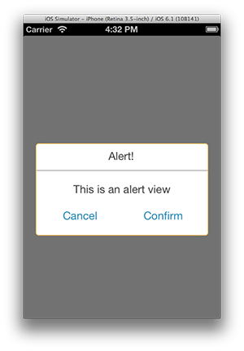
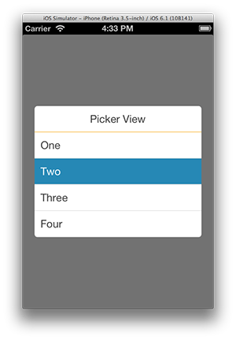

CLPModal
========

```CLPModal``` is a custom modal view base class with 2 example implementations - a custom alert view & a picker view. It supports being shown and dismissed from any lateral direction - Top, Bottom, Left or Right.

## Installation
Clone the repository (or add it as a submodule) and then add the files to your project.  
At a minimum, you need to add ```CLPModalView.h```, ```CLPModalView.m``` and ```CLPModal_Private.h```.

## Implementation
```CLPModal``` works by adding a view directly to the application's ```UIWindow```, meaning it will work if you're calling it from a controller that has been presented modally via ```-[UIViewController presentModalViewController:animated:]```.

A ```CLPModal``` contains 2 views as properties - ```animationView``` & ```contentView```.

The ```animationView``` is the root level view to allow for view transition containment, giving you the option to use calls like ```-[UIView transitionFromView:toView:duration:options:completion:]```.

The ```contentView``` is where the main content of the modal view should be added (note: I chose not to override ```-[UIView addSubview:]``` in order to allow for more flexibility down the line, at the expense of some complexity).

## Usage
```CLPModal``` is a base class that shouldn't be instantiated (because it'll be the most boring modal view ever!).
You should subclass it and implement your own content, adding subviews to the ```contentView```, or if you're feeling adventurous, you can replace the entire view.

So simply add your subviews inside ```-(void)loadView``` and then present the modal as follows:

	YourCustomModal* modal = [[YourCustomModal alloc] init];
	[modal show];

or

	[[[YourCustomModal alloc] init] show];

Obviously, you'll probably end up with more complex initialisers (see ```CLPAlertView``` or ```CLPPickerView``` for examples).

### CLPAlertView
```CLPAlertView``` is a custom alert view that is block based, because who doesn't love blocks?!



Usage is as follows:
  
	CLPAlertView* alert = [CLPAlertView alertWithTitle:@"Alert!" message:@"This is an alert view"];   
	[alert setConfirmButtonWithTitle:@"Confirm" block:^{   
		//Do things
	}];   
	[alert setCancelButtonWithTitle:@"Cancel" block:^{   
		//Don't do things
	}];   
	[alert show];  

Tapping either the confirm or cancel buttons will dismiss the modal view automagically. 

### CLPPickerView
```CLPPickerView``` is a modal tableview that when a cell is tapped, will fire it's completion block & return the selected index as well as the title string. It can have a preselected value and be told to scroll to a given row.
 


Usage is as follows:

	CLPPickerView* picker = [[CLPPickerView alloc] initWithTitle:@"Picker View" items:@[@"One", @"Two", @"Three", @"Four"] selectedIndex:1 scrollIndex:0 completion:^(NSString *value, NSInteger index) {
		//Do things
	}];
	[picker show];

## Questions & Contribution
Direct any questions you have to me via Issues or on Twitter [at] thepaddedcell & if you'd like to contribute then send me a pull request and I'll take a look.


Cheers!

## [LICENSE](LICENSE)

